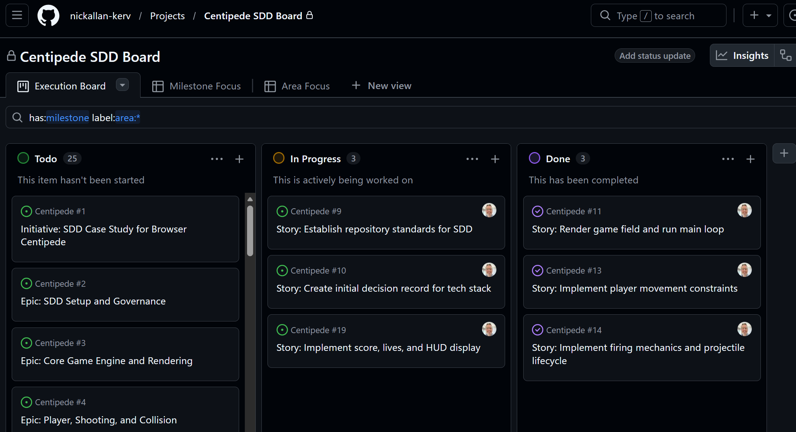

# Centipede (Browser) - Spec-Driven Development Case Study

## 1. Introduction
This repository is a learning and demonstration project focused on building a browser-based version of the classic arcade game **Centipede** while practicing **Spec-Driven Development (SDD)**.

The primary experiment is to use **GitHub Issues as living specifications** for the full delivery lifecycle:
- Requirements definition
- Design decisions
- Implementation planning
- Testing and validation
- Delivery and retrospective learning

This work is authored from the perspective of a Data Architect and will be presented as findings to the **Frontier Data Club**.

## 2. Project Goals
1. Build a playable browser-based Centipede game.
2. Apply SDD practices from inception to delivery.
3. Use GitHub Issues as the single source of truth for scope and behavior.
4. Capture traceability from requirement to code to test evidence.
5. Produce a reusable case study for the Frontier Data Club.

## 3. What Is Spec-Driven Development?
Spec-Driven Development is an approach where implementation is guided by explicit, reviewable specifications before code is written. In this project, specifications are not static documents; they are represented as structured GitHub Issues that evolve as understanding improves.

Core SDD principles used here:
- **Specification first**: define behavior and constraints before implementation.
- **Traceability**: link requirements, tasks, commits, pull requests, and tests.
- **Testable acceptance criteria**: every requirement is verifiable.
- **Iterative refinement**: specs are updated as discoveries are made.
- **Decision transparency**: architecture and trade-offs are documented in Issues.

## 4. Why GitHub Issues Are Being Used as Specifications
GitHub Issues provide practical capabilities that support SDD:
- Structured discussion, ownership, and status in one place.
- Labels and milestones for planning and progress tracking.
- Cross-linking between Epic, Story, Task, Bug, and Decision records.
- Native connection to pull requests, commits, and checks.
- Easy exportability for reporting and case-study storytelling.

In this approach, an Issue is not just a to-do item. It is a specification artifact with:
- Context
- Problem statement
- Scope boundaries
- Acceptance criteria
- Test evidence expectations
- Risks and dependencies

## 5. Project Scope
In scope:
- Single-player browser game inspired by classic Centipede.
- Core loop: move, shoot, destroy centipede segments, avoid enemies.
- Score tracking and increasing challenge over time.
- Keyboard-based controls for desktop browser.
- Basic sound effects (optional if time permits but tracked explicitly).
- SDD operating model using GitHub Issues for end-to-end lifecycle.

## 6. Out of Scope
Out of scope for initial case study:
- Multiplayer support.
- Mobile/touch-first control optimization.
- Backend services and account systems.
- Cloud leaderboard persistence.
- Full accessibility certification.
- Pixel-perfect clone of any copyrighted original assets.

## 7. Functional Requirements for the Centipede Game
FR-01 Game initializes and displays playable field in browser.

FR-02 Player can move horizontally and vertically within allowed region.

FR-03 Player can fire projectiles with input rate constraints.

FR-04 Projectile collision destroys mushrooms and/or enemies per rules.

FR-05 Centipede consists of multiple segments with directional movement behavior.

FR-06 Hitting centipede segment updates segment behavior and score.

FR-07 Mushrooms act as obstacles and influence centipede pathing.

FR-08 Enemy entities (for example spider/flea/scorpion variants) appear according to level logic (phased implementation allowed).

FR-09 Player loses life on collision with enemy/contact hazard.

FR-10 Game over state is triggered when lives reach zero.

FR-11 Score is displayed and updated in real time.

FR-12 Level progression increases challenge based on explicit rules.

FR-13 Restart flow resets required game state without full page reload.

FR-14 Pause/resume behavior is supported.

FR-15 Core game rules and controls are documented in-repo.

## 8. Non-Functional Requirements
NFR-01 Performance: Maintain smooth gameplay target of approximately 60 FPS on modern desktop browsers.

NFR-02 Compatibility: Support current stable versions of Chrome, Edge, and Firefox.

NFR-03 Reliability: No critical runtime errors during standard 10-minute play session.

NFR-04 Maintainability: Modular code structure with clear domain boundaries.

NFR-05 Testability: Deterministic logic units are isolated and unit tested.

NFR-06 Observability: Error conditions and key state transitions are loggable in development mode.

NFR-07 Documentation quality: Every major feature has linked spec Issue and acceptance checks.

NFR-08 Delivery transparency: Changes map to Issues through commit/PR references.

## 9. Proposed Issue Hierarchy
Use a lightweight hierarchy:
- **Initiative**: SDD Case Study for Browser Centipede
- **Epic**: Large capability area (engine, player, enemies, scoring, QA/reporting)
- **Story/Spec Issue**: User-visible behavior and acceptance criteria
- **Task**: Implementation unit
- **Bug**: Defect found during validation
- **Decision Record Issue**: Architectural or product trade-off
- **Learning Log Issue**: Reflection tied to SDD method outcomes

Relationship conventions:
- Epic Issues contain child Story links.
- Story Issues contain task checklist and test checklist.
- PRs must reference at least one Story or Bug Issue.

## 10. Labels and Milestones
### Recommended Labels
Process:
- `type:initiative`
- `type:epic`
- `type:story`
- `type:task`
- `type:bug`
- `type:decision`
- `type:learning`

Priority:
- `priority:p0`
- `priority:p1`
- `priority:p2`

Status:
- `status:ready`
- `status:in-progress`
- `status:blocked`
- `status:review`
- `status:done`

Quality:
- `qa:needed`
- `qa:passed`

Area:
- `area:engine`
- `area:player`
- `area:enemies`
- `area:ui`
- `area:testing`
- `area:docs`

### Milestones
- `M1 - SDD Setup & Specs Baseline`
- `M2 - Core Gameplay Vertical Slice`
- `M3 - Complete Gameplay Loop`
- `M4 - Quality, Reporting, and Presentation`

## 11. Definition of Ready
An Issue is ready when:
- Problem statement is clear.
- Scope and out-of-scope are explicit.
- Acceptance criteria are measurable.
- Dependencies are identified.
- Test approach is listed.
- Labels, milestone, and owner are assigned.

## 12. Definition of Done
An Issue is done when:
- All acceptance criteria pass.
- Required tests are implemented and passing.
- Documentation is updated.
- Linked PR is merged.
- Evidence (screenshots, test output, notes) is attached.
- Follow-up risks are captured in new Issues if needed.

## 13. Issue Templates
Use these templates directly in GitHub Issue descriptions.

### Template A: Story/Specification
```md
## Summary
As a [role], I want [capability], so that [outcome].

## Context
- Background:
- Problem:
- Constraints:

## In Scope
-

## Out of Scope
-

## Acceptance Criteria
- [ ] AC-01
- [ ] AC-02
- [ ] AC-03

## Test Plan
- Unit tests:
- Integration/E2E tests:
- Manual validation:

## Dependencies
-

## Risks
-

## Evidence Required for Done
- [ ] Test results attached
- [ ] Screenshot/video attached
- [ ] Docs updated
```

### Template B: Decision Record
```md
## Decision

## Context

## Options Considered
1. Option A
2. Option B
3. Option C

## Decision Outcome

## Consequences
- Positive:
- Negative:

## Follow-Up Actions
- [ ] Action 1
```

### Template C: Learning Log
```md
## Experiment Focus

## Hypothesis

## What Happened

## Evidence

## What We Learned About SDD + GitHub Issues

## Changes for Next Iteration
```

## 14. Development Workflow
1. Create or refine Story/Spec Issue before coding.
2. Validate Definition of Ready.
3. Break story into tasks in Issue checklist or linked task Issues.
4. Implement in small PRs referencing Issue IDs.
5. Run automated and manual tests mapped to acceptance criteria.
6. Perform review against spec, not only code style.
7. Merge when Definition of Done is satisfied.
8. Close Issue with evidence and summary.
9. Log learning insights in dedicated Learning Issues.

Branch and commit conventions:
- Branch: `issue-<id>-short-description`
- Commit: `refs #<id>: concise change summary`
- PR title: `[#<id>] Implement <story title>`

## 15. Testing Strategy
Testing is specification-driven and maps directly to acceptance criteria.

Test layers:
- Unit tests for deterministic mechanics (movement, collisions, scoring).
- Integration tests for game loop interactions.
- End-to-end smoke checks for launch, play, lose life, game over, restart.
- Manual exploratory tests for playability and balance.

Traceability model:
- Each acceptance criterion references at least one test case.
- Each test case references Issue ID(s).
- Test evidence is attached to PR and/or Issue.

## 16. Learning Objectives
1. Learn how to write high-quality, testable Issue specifications.
2. Evaluate if GitHub Issues can replace separate requirements documents for a small product.
3. Measure overhead versus clarity gained.
4. Identify failure modes (spec drift, vague criteria, weak traceability).
5. Build a repeatable SDD playbook for future projects.

## 17. Success Criteria
The project is successful if:
- A playable Centipede implementation is delivered.
- At least 90% of implemented features map to documented Issue acceptance criteria.
- Every merged PR references at least one Issue.
- Key architecture/product decisions are captured as decision Issues.
- A final findings report is produced for Frontier Data Club.

## 18. Reporting Findings to the Frontier Data Club
Final report structure:
1. Project overview and goals.
2. SDD process model used.
3. Quantitative metrics (Issue counts, cycle time, defect rate, traceability coverage).
4. Qualitative observations (clarity, collaboration, maintainability).
5. What worked, what did not, and why.
6. Recommended adoption pattern for similar teams.

Suggested metrics to track:
- Number of spec Issues created vs completed.
- Average time from ready to done per Issue.
- Defects per Epic.
- Percentage of PRs with complete acceptance evidence.

## 19. Lessons Learned
Use this section continuously during delivery.

Initial placeholder:
- Lesson 1: To be captured.
- Lesson 2: To be captured.
- Lesson 3: To be captured.

## 20. Next Steps
1. Create milestones and labels in GitHub.
2. Create initial Initiative and Epic Issues.
3. Import the initial backlog from this repository into GitHub Issues.
4. Start with the Core Gameplay Vertical Slice Epic.
5. Track learnings weekly and prepare Frontier Data Club summary deck.

## 21. Workflow Progress So Far
- Created and published the `nickallan-kerv/Centipede` repository with project documentation and automation scripts.
- Established the SDD issue model: initiative, epics, stories, decision records, and learning logs.
- Imported and organized the initial backlog (31 issues) with labels, milestones, and project board linkage.
- Configured project views for execution (`Execution Board`, `Milestone Focus`, and `Area Focus`).
- Activated first sprint items, implemented the vertical slice for loop/movement/firing, and closed issues #11, #13, and #14 with acceptance evidence.

### First Sprint Kanban Board


## Appendix: Backlog Import Automation
This repository includes a GitHub CLI automation script to create labels, milestones, and the initial issue backlog.

Prerequisites:
- GitHub CLI (`gh`) installed and authenticated.
- Run from the repository root.

Dry run (no changes made):
```powershell
powershell -NoProfile -ExecutionPolicy Bypass -File .\scripts\import-initial-backlog.ps1 -Repo <owner/repo> -DryRun
```

Create artifacts in GitHub:
```powershell
powershell -NoProfile -ExecutionPolicy Bypass -File .\scripts\import-initial-backlog.ps1 -Repo <owner/repo>
```

Output:
- `issue-map.json` generated at repo root with `ISSUE-KEY -> GitHub issue number` mappings.

---

## Appendix: How To Use This Repository as a Case Study
- Treat Issues as source-of-truth specifications.
- Keep code, tests, and docs linked to Issues.
- Prefer small, reviewable changes with explicit acceptance evidence.
- Capture learning as first-class deliverables, not afterthoughts.
